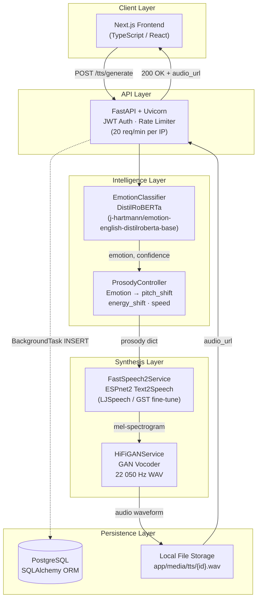
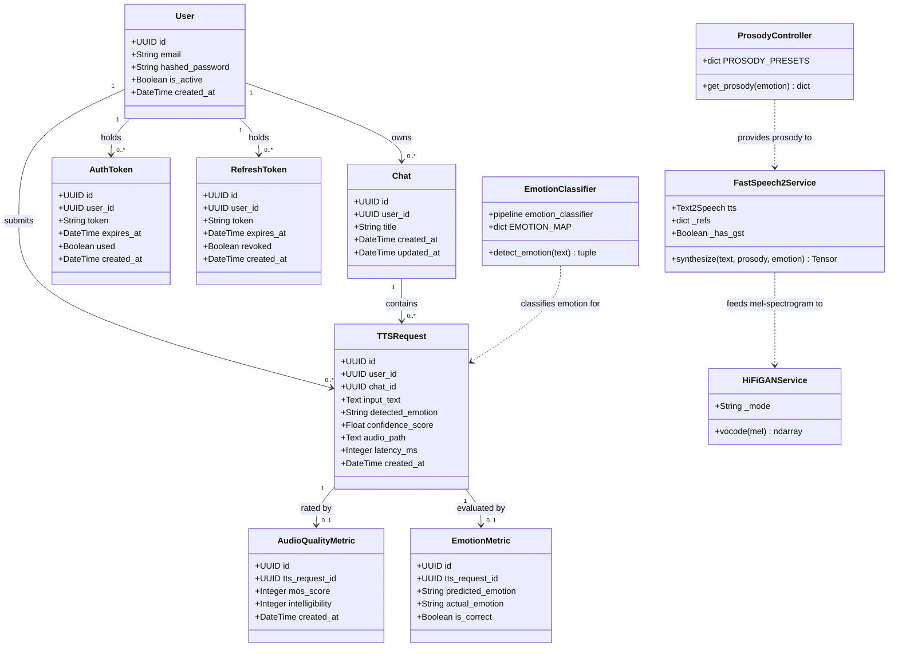
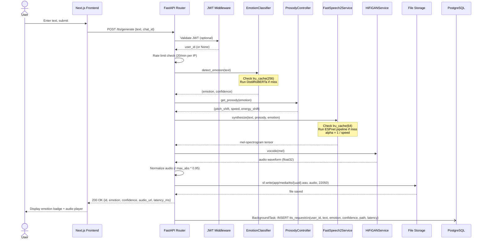
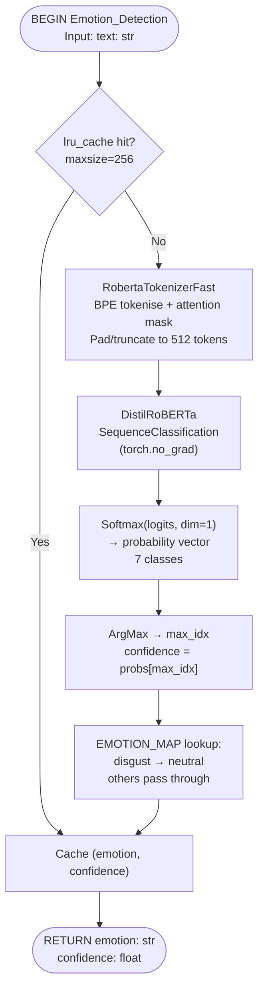
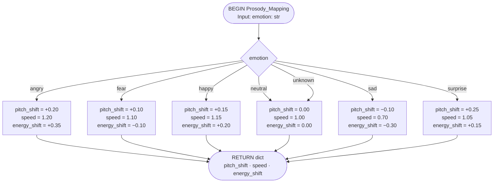
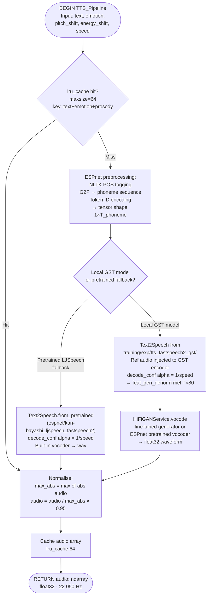
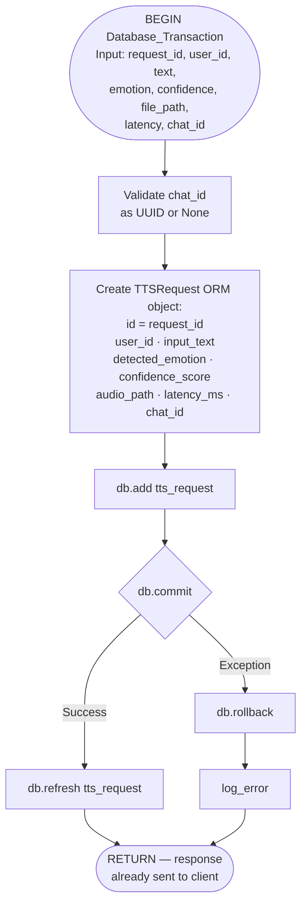
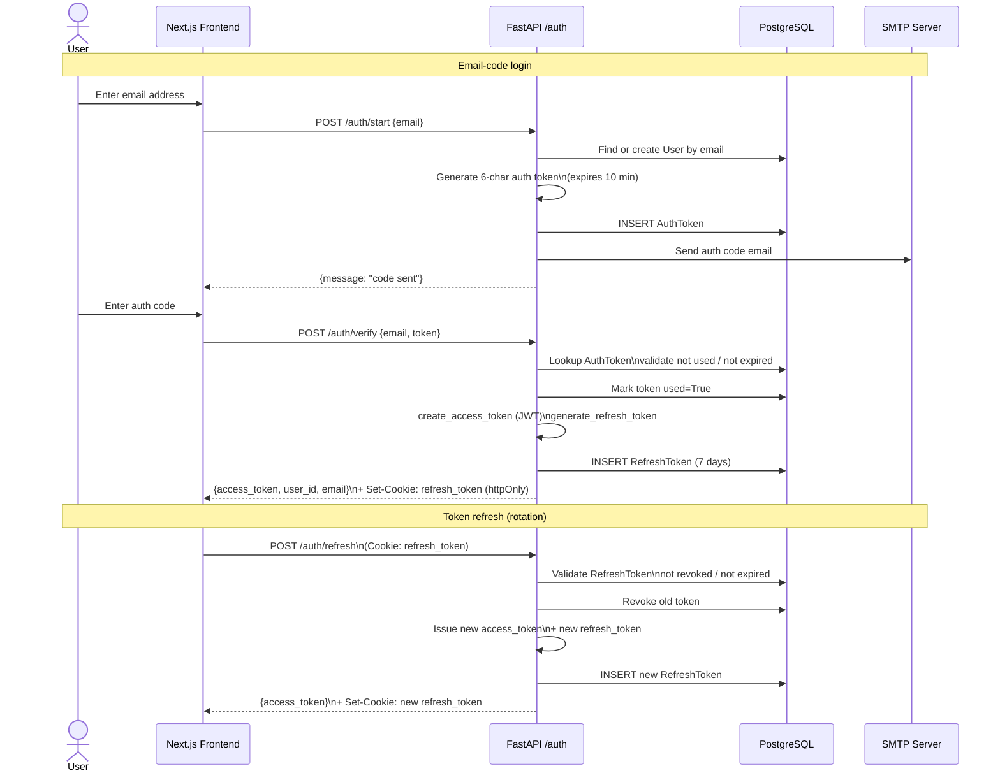

# EA-TTS System Diagrams (Mermaid.js)

All diagrams are based directly on the implemented source code.

---

## Figure 3.1 — System Architecture Workflow



---

## Figure 3.2 — Class Diagram



---

## Figure 3.3 — Sequence Diagram



---

## Figure 3.4 — System Flowchart

```mermaid
flowchart TD
    A([Receive POST /tts/generate]) --> B{Validate JWT\n+ rate limit}
    B -->|"429 Too Many Requests"| ERR1([Return 429])
    B -->|OK| C{Check synthesis\ncache\nlru_cache 64}

    C -->|Hit| D[Retrieve cached\naudio array]
    C -->|Miss| E{Check emotion\ncache\nlru_cache 256}

    E -->|Hit| F[Return cached\nemotion + confidence]
    E -->|Miss| G[Run DistilRoBERTa\ninference\ntorch.no_grad]
    G --> H[Softmax logits\n→ argmax\n→ map EMOTION_MAP]
    H --> I[Cache emotion result\nlru_cache 256]
    I --> F

    F --> J[ProsodyController\nLookup PROSODY_PRESETS]
    D --> K
    J --> K[ESPnet pipeline\nNLTK POS tagging\nG2P → phoneme IDs]
    K --> L[FastSpeech2 encoder\n→ variance predictors]
    L --> M[Apply prosody:\nalpha = 1 / speed\npitch_shift · energy_shift]
    M --> N[FastSpeech2 decoder\n→ mel-spectrogram T×80]
    N --> O[HiFi-GAN vocoder\n→ float32 waveform]
    O --> P[Normalise:\naudio / max_abs × 0.95]
    P --> Q[Cache audio result\nlru_cache 64]

    Q --> R[sf.write\napp/media/tts/{uuid}.wav\n22 050 Hz]
    R --> S[Return HTTP 200\naudio_url · emotion\nconfidence · latency_ms]
    S --> T([BackgroundTask:\nINSERT to PostgreSQL])
```

---

## Algorithm 3.8.1 — Emotion Detection



---

## Algorithm 3.8.2 — Prosody Mapping



---

## Algorithm 3.8.3 — TTS Generation Pipeline



---

## Algorithm 3.8.4 — Database Logging



---

## Bonus — Auth Flow Sequence


